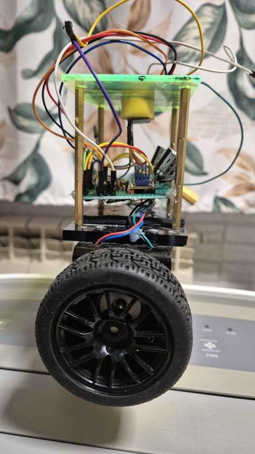
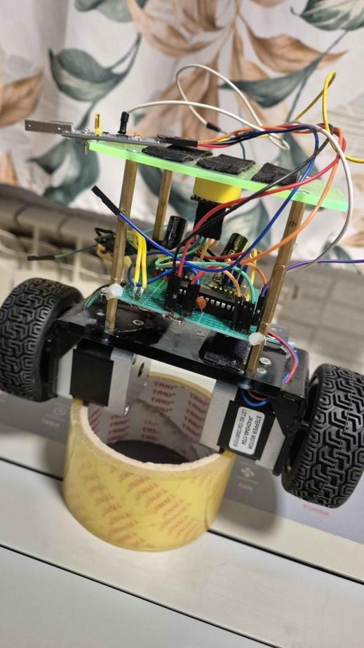
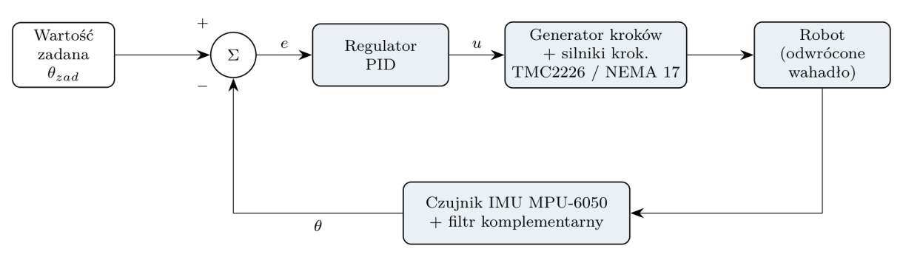
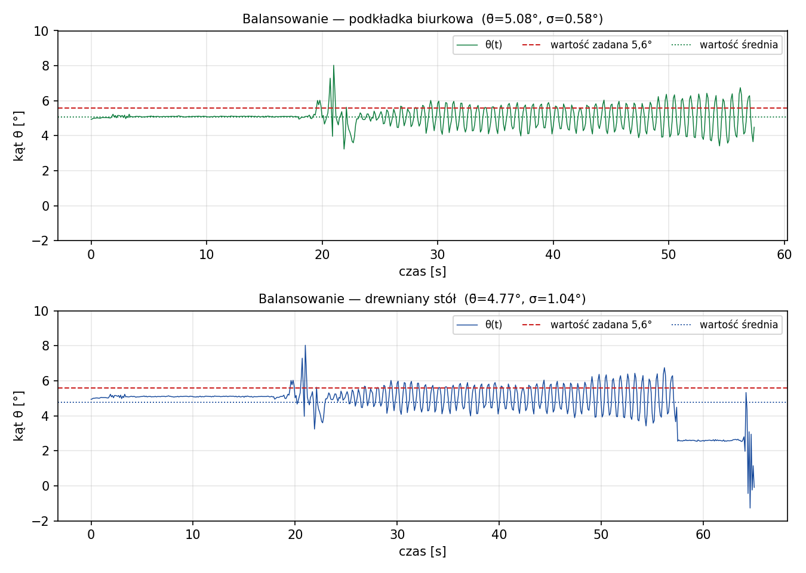
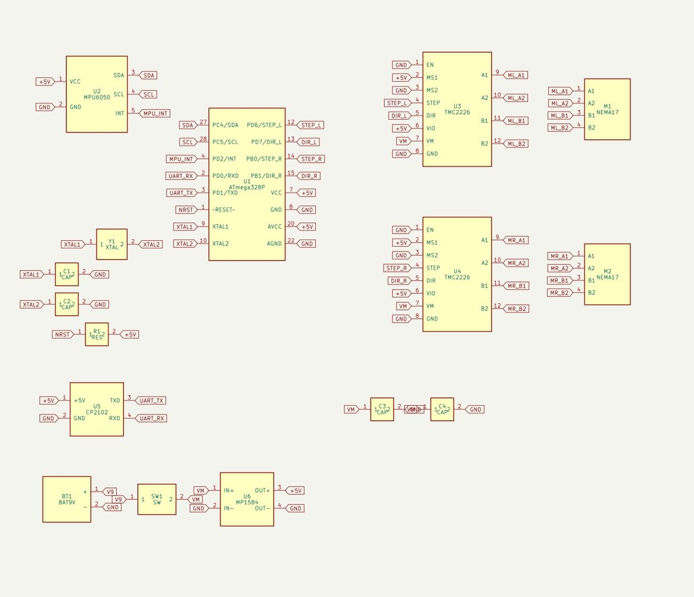
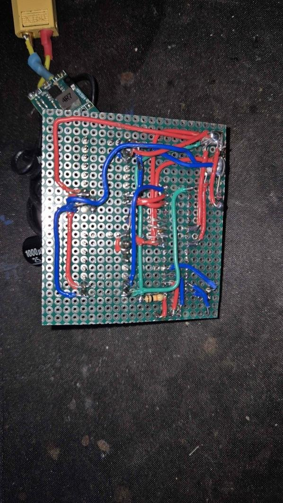

# Self-balancing robot (inverted pendulum)

Two-wheeled robot that keeps itself upright using an IMU and a PID controller running at 250 Hz on a bare **ATmega328P**.
Course project at Poznan University of Technology (Computer Architecture, 2026) – designed, built, programmed and documented almost entirely by me.

  
  

**Result:** the robot holds its balance with a standard deviation of about **0.6°** on a smooth surface.

## How it works

| Stage | Implementation |
|---|---|
| Tilt measurement | MPU-6050 (accelerometer + gyroscope) over I²C, gyro bias calibration at start-up |
| Sensor fusion | Complementary filter, α = 0.98 (time constant ≈ 0.2 s) |
| Controller | Discrete PID, Kp = 65, Ki = 0.4, Kd = 1.0, anti-windup (integral clamped to ±25), D term computed from the gyro measurement with a low-pass filter |
| Actuators | 2 × NEMA 17 steppers driven by TMC2226 (STEP/DIR); step pulses generated in the **Timer1 compare-match interrupt**, so the stepping rhythm does not depend on the main loop |
| Safety | Motors are cut off when the tilt error exceeds 35° (fall detection) |

## My part
Nearly all of the project: mechanical design and construction, electronics and wiring, firmware, PID tuning on real hardware (Kp → Kd → Ki → setpoint trim), tests and the 40-page documentation.

## Problems solved
- **I²C bus lock-up after a fall** – the MPU-6050 could hold SDA low, so a reset was not enough. Fixed with a bus-recovery routine (clocking SCL) and a software sensor reset at every start-up.
- **Unstable stepper drivers** – the first prototype on TMC2209 did not work reliably; the design was moved to TMC2226.
- **Vibrations on hard, slippery surfaces** – measured and documented with telemetry (see below).

## Test results

Tilt angle logged over the serial port on two surfaces: desk mat (std. dev. 0.58°) and wooden table (std. dev. 1.04°).

## Hardware

  
  

ATmega328P (16 MHz) · MPU-6050 (GY-521) · 2 × TMC2226 · 2 × NEMA 17 (1.8°, 1.7 A) · MP1584 buck converter 9 V → 5 V · 9 V battery · point-to-point wiring on a perfboard.
The full bill of materials is in the documentation.

## Repository contents
- `firmware/` – Arduino (AVR) source code: `balanser.ino` (main version) and `balanser_obrot.ino` (experimental variant with automatic turning)
- `docs/` – full technical documentation (in Polish, 40 pages): theory, schematics, BOM, firmware listing, tuning procedure, tests
- `images/` – photos and diagrams

## Build & run
1. Open `firmware/balanser.ino` in Arduino IDE, board: **Arduino Uno** (ATmega328P, 16 MHz).
2. Upload through a USB-UART converter (CP2102).
3. Hold the robot upright and still for ~2 s while the gyroscope calibrates.

## What's next
Remote control (Bluetooth / nRF24L01), outer speed/position loop (cascade control), dedicated PCB, stepper driver configuration over UART.

## Course team
Piotr Janas · Piotr Dobry · Hubert Rudowicz
